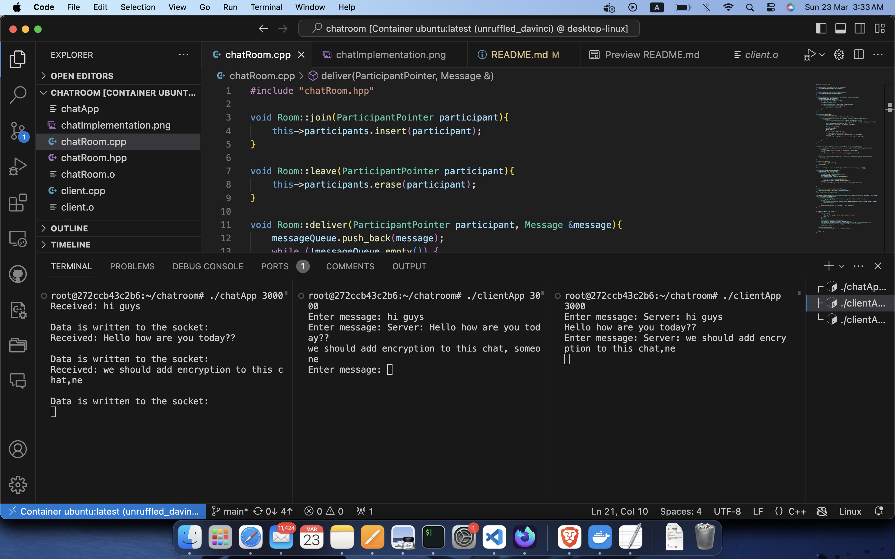

# Asynchronous Concurrent Chat Server (ACCS) alias ChatRoom
Project Docs: https://deepwiki.com/mohitvdx/Asynchronous-Concurrent-Chat/1-system-overview

## Project Overview

ChatRoom is a robust and scalable chat room application developed in C++ leveraging the power of Boost.Asio for asynchronous network operations and the standard C++ threading library for concurrent client management. This application enables real-time, multi-user communication within a single chat room environment. The design emphasizes non-blocking I/O to maximize server efficiency and responsiveness, allowing a single server instance to handle a significant number of concurrent client connections.

This project demonstrates key software engineering principles, including modular design, separation of concerns, and efficient resource utilization through asynchronous programming. It serves as a practical example of building network-based applications with a focus on performance and scalability.



## Key Features

* **High-Performance Asynchronous Communication:** Implements non-blocking I/O using Boost.Asio, enabling the server to efficiently handle numerous concurrent client connections without the overhead of traditional blocking I/O. This architecture allows for optimal resource utilization and low-latency communication.
* **Concurrent Client Handling via Threading:** Utilizes the standard C++ threading library to dedicate a thread to each client session. This ensures that each client's interactions are handled independently, preventing any single client from blocking the operations of others and improving the overall responsiveness of the application.
* **Scalable Room Management:** Provides a well-defined `Room` abstraction to manage connected clients. The room is responsible for maintaining a collection of active participants and efficiently broadcasting messages to all connected clients, facilitating group communication.
* **Robust Message Handling:** Encapsulates message handling logic within the `Message` class, which includes encoding and decoding message headers to manage message length and ensure proper delivery. This layer provides a clear interface for message construction and interpretation across the client and server.
* **Clear Separation of Concerns:** The project adheres to the principle of separation of concerns, with distinct classes responsible for specific functionalities: `Session` for individual client connections, `Room` for managing the chat environment, and `Message` for data transfer. This design promotes maintainability and testability.

## Architecture

The ChatRoom application follows a client-server architecture with the following key components:

* **`Server`:** The central component responsible for listening for incoming client connections on a specified port. Upon accepting a connection, it creates a new `Session` object to handle communication with that client. The `Server` also manages the central `Room` instance.
* **`Client`:** The application that users interact with. It establishes a connection to the `Server` and allows users to send and receive messages. The `Client` uses Boost.Asio for its network operations and a separate thread for handling user input concurrently with receiving messages from the server.
* **`Session`:** Represents an individual connection between the `Server` and a `Client`. Each `Session` object is responsible for:
    * Managing the socket associated with the client.
    * Asynchronously reading incoming messages from the client using Boost.Asio's `async_read_until`.
    * Decoding the message using the `Message` class.
    * Delivering the received message to the `Room` for broadcast.
    * Receiving messages from the `Room` and asynchronously writing them back to the client using Boost.Asio's `async_write`.
    * Maintaining a message queue for outgoing messages to ensure ordered delivery.
* **`Room`:** Manages a collection of `Session` objects (representing connected clients). It provides the following functionalities:
    * Adding new `Session` objects when clients connect (`join`).
    * Removing `Session` objects when clients disconnect (`leave`).
    * Receiving messages from individual `Session` objects and broadcasting them to all other connected `Session` objects (`deliver`). It maintains a message queue for internal processing.
* **`Message`:** A utility class responsible for encapsulating the data exchanged between the `Client` and the `Server`. It handles:
    * Encoding the message body with a fixed-size header indicating the body length. This ensures proper message framing during network transmission.
    * Decoding the header to determine the message body length upon reception.
    * Providing methods to access the raw message data and the message body.

## Critical Functionalities

### Asynchronous Input/Output (I/O) with Boost.Asio

The core of the server's scalability lies in its use of Boost.Asio for asynchronous I/O operations. Instead of blocking the execution thread while waiting for network events (like data being received or sent), Boost.Asio allows the application to initiate an operation and then continue with other tasks. When the operation completes, a completion handler (a callback function) is executed.

* **`async_read_until`:** This method in the `Session` class is used to asynchronously read data from the client socket until a specific delimiter (`\n` in this case) is encountered. This simplifies message parsing as it ensures that a complete message is read before processing. The completion handler for `async_read_until` processes the received data, creates a `Message` object, and delivers it to the `Room`. It then initiates another asynchronous read operation to listen for the next message.
* **`async_write`:** When the `Session` needs to send a message to a client, it uses `async_write`. This method asynchronously writes the message data to the client's socket. A completion handler is provided to handle potential errors during the write operation.

This asynchronous approach allows the server's main thread (the `io_context`'s thread) to efficiently manage multiple client connections by switching between different tasks as I/O operations complete, rather than being blocked by any single connection.

### Concurrent Client Handling with Threading

To ensure that the server remains responsive even under heavy load, each incoming client connection is handled by a dedicated thread. When the server accepts a new connection, a `Session` object is created, and its `start()` method is called. This method typically initiates the asynchronous read operations for that client.

While Boost.Asio itself is asynchronous, using a separate thread for each session allows for better isolation and can simplify the logic for managing individual client states. The `io_context.run()` call in the main thread of the server is responsible for dispatching the completion handlers for all asynchronous operations across all connected clients.

### Session Management

The `Session` class is crucial for managing the lifecycle and communication of a single client connection. Key aspects of session management include:

* **Initialization:** When a new client connects, a `Session` object is created with the client's socket and a reference to the shared `Room` object.
* **Joining the Room:** Upon creation, the `Session` registers itself with the `Room` using the `join()` method, making it a participant in the chat.
* **Message Handling:** The `Session` is responsible for receiving messages from the client, decoding them, and delivering them to the `Room`. It also receives messages broadcast by the `Room` and sends them to its associated client.
* **Disconnection Handling:** When a client disconnects (either gracefully or due to an error), the `async_read` operation will likely encounter an error (e.g., `boost::asio::error::eof`). The completion handler for `async_read` handles this scenario by removing the `Session` from the `Room` using the `leave()` method, ensuring that the disconnected client no longer receives messages.
* **Outgoing Message Queue:** The `Session` maintains a queue (`messageQueue`) for outgoing messages. This ensures that messages are written to the socket in the order they are received from the `Room`, even though the write operations are asynchronous.

### Room Management

The `Room` class provides a central point for managing all connected clients and facilitating message broadcasting. Its key responsibilities include:

* **Participant Tracking:** The `Room` maintains a `std::set` of `ParticipantPointer` (which are `std::shared_ptr` to `Session` objects in this case). Using a `std::set` ensures that each participant is stored only once and allows for efficient addition and removal.
* **Joining and Leaving:** The `join()` method adds a new participant to the set, and the `leave()` method removes a participant.
* **Message Delivery:** The `deliver()` method is responsible for taking a message and broadcasting it to all participants in the room (except the sender). It iterates through the set of participants and calls the `write()` method of each `Session` to enqueue the message for sending. The use of a queue in both `Room` and `Session` ensures that messages are processed and sent in the order they are received.

## Low-Level Design (LLD)

The class diagram provides a visual representation of the project's structure and the relationships between its core components. Let's break down each class and its responsibilities:

* **`Participant` (Interface):** Defines the contract for any object that can participate in the chat room. It specifies two pure virtual methods:
    * `deliver(Message& message)`: An abstract method that participants must implement to handle receiving a message.
    * `write(Message& message)`: An abstract method that participants must implement to send a message.
    This interface allows for potential future extensions where different types of participants (e.g., bots) could be added to the room.

* **`Session` (Class):** Implements the `Participant` interface and represents a single client connection.
    * **`-tcp::socket clientSocket`:** The Boost.Asio socket object used for communication with the client.
    * **`-boost::asio::streambuf buffer`:** A buffer used for asynchronous read operations.
    * **`-Room& room`:** A reference to the `Room` object that this session belongs to. This allows the session to interact with the room (e.g., to deliver messages).
    * **`-std::deque<Message> messageQueue`:** A queue to hold outgoing messages waiting to be written to the client socket.
    * **`+Session(tcp::socket s, Room& room)`:** Constructor to initialize a new `Session` object.
    * **`+start()`:** Initiates the session by joining the room and starting asynchronous read operations.
    * **`+deliver(Message& message)`:** Implements the `Participant` interface's `deliver` method. It enqueues the message to be sent to the client.
    * **`+write(Message& message)`:** Implements the `Participant` interface's `write` method. It enqueues the message for asynchronous writing to the socket.
    * **`+async_read()`:** Initiates an asynchronous read operation on the client socket.
    * **`+async_write(std::string messageBody, size_t messageLength)`:** Initiates an asynchronous write operation to the client socket.

* **`Room` (Class):** Manages the chat room environment.
    * **`-std::deque<Message> messageQueue`:** A queue for messages being processed within the room.
    * **`-std::set<ParticipantPointer> participants`:** A set to store pointers to all participants (currently `Session` objects) in the room. Using `std::set` ensures uniqueness and efficient lookups.
    * **`+join(ParticipantPointer participant)`:** Adds a participant to the room.
    * **`+leave(ParticipantPointer participant)`:** Removes a participant from the room.
    * **`+deliver(ParticipantPointer participant, Message& message)`:** Receives a message from a participant and broadcasts it to all other participants in the room.

* **`Message` (Class):** Represents a message exchanged between clients and the server.
    * **`-char data[header+maxBytes]`:** A fixed-size buffer to store the message header and body.
    * **`-size_t bodyLength_`:** Stores the length of the message body.
    * **`+Message()`:** Default constructor.
    * **`+Message(std::string message)`:** Constructor to create a message from a string.
    * **`+getData() std::string`:** Returns the raw message data (header + body).
    * **`+getBody() std::string`:** Returns the message body.
    * **`+getNewBodyLength(size_t newLength) size_t`:** Validates and returns the new body length.
    * **`+encodeHeader()`:** Encodes the message body length into the header.
    * **`+decodeHeader() bool`:** Decodes the header to retrieve the message body length and returns `false` if the length exceeds the maximum allowed.
    * **`+getBodyLength() size_t`:** Returns the current body length.
    * **`+printMessage()`:** A utility method to print the message content.

* **`Server` (Class):** Contains the main entry point for the server application.
    * **`-boost::asio::io_context io_context`:** The core Boost.Asio object that provides I/O services.
    * **`-tcp::acceptor acceptor`:** A Boost.Asio acceptor object used to listen for incoming connections.
    * **`-Room room`:** The central `Room` object managed by the server.
    * **`+main(int argc, char* argv)`:** The main function of the server application.
    * **`+accept_connection(io_context, port, acceptor, room, endpoint)`:** Asynchronously accepts incoming client connections and creates new `Session` objects.

* **`Client` (Class):** Contains the main entry point for the client application.
    * **`-boost::asio::io_context io_context`:** The core Boost.Asio object for the client's I/O operations.
    * **`-tcp::socket socket`:** The Boost.Asio socket object used to connect to the server.
    * **`-std::thread input_thread`:** A separate thread to handle user input.
    * **`+main(int argc, char* argv)`:** The main function of the client application.
    * **`+async_read(tcp::socket& socket)`:** Asynchronously reads messages from the server.

* **`boost_asio_io_context` (Class - Conceptual):** Represents the Boost.Asio I/O context, highlighting its key methods used in the project.
    * **`+run()`:** Runs the I/O event loop, dispatching completion handlers.
    * **`+post(function)`:** Posts a function to be executed on the `io_context`'s thread.

* **`Thread_Model` (Concept):** Describes the threading model used in the application.
    * **`IO Thread: Runs io_context.run()`:** The main thread of the server and the thread running `io_context.run()` in the client are responsible for handling asynchronous operations.
    * **`Input Thread: Handles user input`:** The client uses a separate thread to read user input from the console, preventing blocking of the main I/O thread.
    * **`Async Callbacks: Run on IO Thread`:** Completion handlers for asynchronous operations are executed on the thread where `io_context.run()` is called.

* **`MessageFlow` (Concept):** Illustrates the flow of messages within the application.
    * **`Client Input → Socket Write`:** When a user types a message in the client, it is written to the client's socket.
    * **`Socket Read → Message Parse → Room Broadcast`:** The server reads the message from the client's socket, parses it, and the `Room` broadcasts it to all participants.
    * **`Room Broadcast → Session Queue → Socket Write`:** The `Room` delivers the message to each `Session`, which enqueues it. The `Session` then asynchronously writes the message to the respective client's socket.

* **`AsyncPattern` (Concept):** Highlights the asynchronous programming patterns used with Boost.Asio.
    * **`async_read_until(delimiter)`:** Used for reading complete messages from the socket.
    * **`async_write(buffer)`:** Used for non-blocking writing of data to the socket.
    * **`post(function)`:** Used to safely perform operations on the `io_context` from other threads (e.g., writing to the socket from the input thread in the client).
    * **`Completion Handlers`:** Callback functions that are executed when asynchronous operations complete.

## Build and Run

**Note for macOS Users:** Boost libraries might not be readily available or easily installable on macOS. To address this, the project was developed within a Docker container running Ubuntu. The development workflow involved SSHing into this container to write and run the code.

To build and run the project, follow these steps:

1.  **Clone the Repository:**
    ```bash
    git clone <repository_url>
    cd ChatRoom
    ```
2.  **(For macOS Users): Set up Docker Container:**
    * Ensure you have Docker installed on your macOS system.
    * Create a Dockerfile (if you haven't already) with an Ubuntu base image and instructions to install necessary dependencies, including Boost.Asio and build tools.
    * Build the Docker image: `docker build -t chatroom_dev .`
    * Run a container from the image, mapping a port for the chat application and potentially a port for SSH: `docker run -d -p <host_port>:<container_port> -p <host_ssh_port>:22 --name chatroom_container chatroom_dev`
    * Find the IP address of your Docker container.
    * SSH into the container: `ssh <user>@<container_ip> -p <host_ssh_port>`
    * Navigate to the project directory within the container.
3.  **(Within the Ubuntu Docker Container or on a system with Boost): Build the Project:**
    Run the `make` command in the project root directory. This will compile the server and client applications.
    ```bash
    make
    ```
    This command utilizes the provided `Makefile` to compile `chatRoom.cpp` into the server executable `chatApp` and `client.cpp` into the client executable `clientApp`. The `Makefile` uses `g++` with C++20 standard, includes necessary Boost libraries for linking, and enables debugging symbols.
4.  **(Within the Docker Container or on a system with Boost): Run the Server:**
    Execute the server application, providing the port number as a command-line argument. For example, to run the server on port 12345:
    ```bash
    ./chatApp 12345
    ```
    The server will start listening for incoming connections on the specified port (within the container). Ensure that the container's port is mapped to a port on your host machine if you are running the client outside the container.
5.  **(Within the Docker Container or on a system with Boost): Run the Client(s):**
    Open one or more terminal windows (either within the Docker container or on your host machine if the port is correctly mapped) and execute the client application, providing the same port number as the server:
    ```bash
    ./clientApp 12345
    ```
    Each client application will connect to the server, and users can start exchanging messages. Type your message in the client terminal and press Enter to send it to the chat room.

## Future Enhancements

One of the planned future enhancements for this project is the integration of post-quantum cryptography (PQC). As quantum computing technology advances, traditional public-key cryptography algorithms like RSA and ECC will become vulnerable to attacks. Implementing post-quantum encryption will ensure the long-term security and confidentiality of communications within the chat room, protecting against potential future threats. This will involve exploring and integrating suitable PQC libraries and algorithms into the existing network communication framework.

## Technical Deep Dive

### Boost.Asio

Boost.Asio is a powerful cross-platform C++ library for network and low-level I/O programming. It provides an asynchronous model that allows applications to handle multiple concurrent connections efficiently. The core concept in Asio is the **I/O context (`io_context`)**, which acts as a central point for all I/O operations. You create I/O objects (like sockets and acceptors) and associate them with an `io_context`. Then, you initiate asynchronous operations on these objects, providing completion handlers that will be executed when the operation finishes.

In this project:

* The `Server` uses an `io_context` to manage the `acceptor` and the sockets of connected clients.
* The `Client` also uses an `io_context` for its socket connection to the server.
* Asynchronous operations like `async_read_until` and `async_write` are initiated on the sockets, and their completion handlers are executed by the `io_context` when the operations complete.
* The `io_context.run()` method blocks until all pending asynchronous operations have completed or the `io_context` has been stopped.

### Threading in the Server

The server utilizes the standard C++ threading library (`std::thread`) to handle each client session in a separate thread. This approach provides the following benefits:

* **Isolation:** Each client's session runs independently, preventing issues in one session from affecting others.
* **Responsiveness:** Even if one client is performing a long operation (though unlikely in this simple chat application), it won't block the handling of other clients.
* **Simplified Logic:** While Boost.Asio is asynchronous, using a thread per session can sometimes simplify the state management for individual connections.

However, it's important to note that for very high concurrency, a purely event-driven approach with Boost.Asio (without a thread per connection) can be more scalable as it reduces the overhead of managing a large number of threads. The current implementation provides a good balance for moderate concurrency and clear separation.

### Message Encoding and Decoding

The `Message` class implements a simple encoding scheme where each message is prefixed with a fixed-size header (4 bytes in this case) that indicates the length of the message body. This is a common technique for framing messages in network communication to ensure that the receiver knows how many bytes to read for a complete message.

* **Encoding:** When a `Message` object is created with a string, the constructor calculates the length of the string, encodes it into the 4-byte header (as an ASCII representation of the integer length), and then copies the string into the data buffer after the header.
* **Decoding:** When the server receives data, it reads until the delimiter (`\n`). The `Message` object's `decodeHeader()` method extracts the first 4 bytes as the header, converts it back to an integer, and sets the `bodyLength_` accordingly. It also performs a check to ensure that the body length doesn't exceed the maximum allowed size. This ensures that the server can correctly interpret the incoming message.
